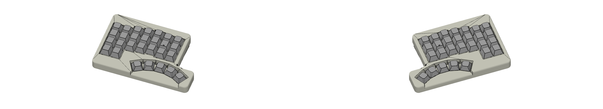

# split-ergo60pct

Generated by [Auto-Keyboard-Design-Kit](https://auto-kdk.pages.dev/)

## Preview

- 3D View

- Top View

## Parts List

|Part|Quantity|
|---|---|
|wired controller|2|
|Conthrough(2.5mm, 11pin)|4|
|USB-C cable|2|
|MX switch and MX socket|56|
|Gateron Low Profile 3.0 switch and MX socket|10|
|Diode|66|
|Keycap|66|

